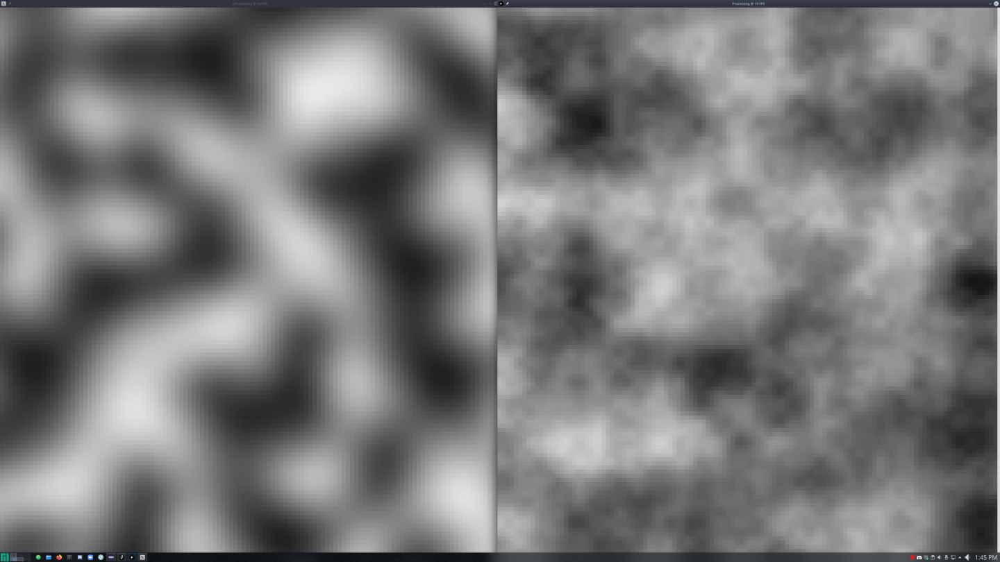

## Gprocessing is a java graphics library built on top of LWJGL, modeled after the processing library, but with an emphasis on performance and 2D game development (3D support may come later).

In addition to the helpful wrapper functions around the Java implementation of OpenGL (LWJGL), providing easy creation of primitives like rectangles, ellipses, triangles and lines, Gprocessing will support sound, images, fonts, input, and basic networking.
Unlike the origional processing 3 language, Gprocessing doesn't limit you to the PDE (processing development enviroment), you can use whatever IDE or editor you like; in addition Gprocessing is just regular java, so you can still use all the normal java libraries.

### Performance vs Processing 3
Running the same intensive code at a resolution of 1920x2160, Gprocessing gets a steady 60 FPS, while processing gets an average of 20 FPS
Gprocessing (Left), Processing 3 (Right)

<br>
### Changelog:
```
+ 5.1.2020
- setup glfw and lwjgl
- Created window class
- setup game loop
- setup basic graphics
- created rect() method
- created pressure test program<br>
+ 5.2.2020
- created engine class
- added FPS counter
- added static class imports to better resemble processing method calls
- added static misc methods: init, map, random, round, println
- cleaned up initialization
- added FPS counter
- created Vector 2D and 3D classes
- added graphics class
- added static methods: fill(), fillAlpha(), and background()
- cleaned up window class
- created github repo
+ 5.3.2020
- added open simplex noise method
+ 5.3.2020-5.5.2020
- implemented ThreadMaster class, allowing the programmer to pass code into a Runnable object that is executed on a seperate thread.
5.6.2020
- added primitive shapes line, circle, and triangle
5.7.2020
- added input class, currently only mouseX and mouseY work
- added color class
- cleaned up file hierarchy
- added inRect and inCircle engine methods.
```
