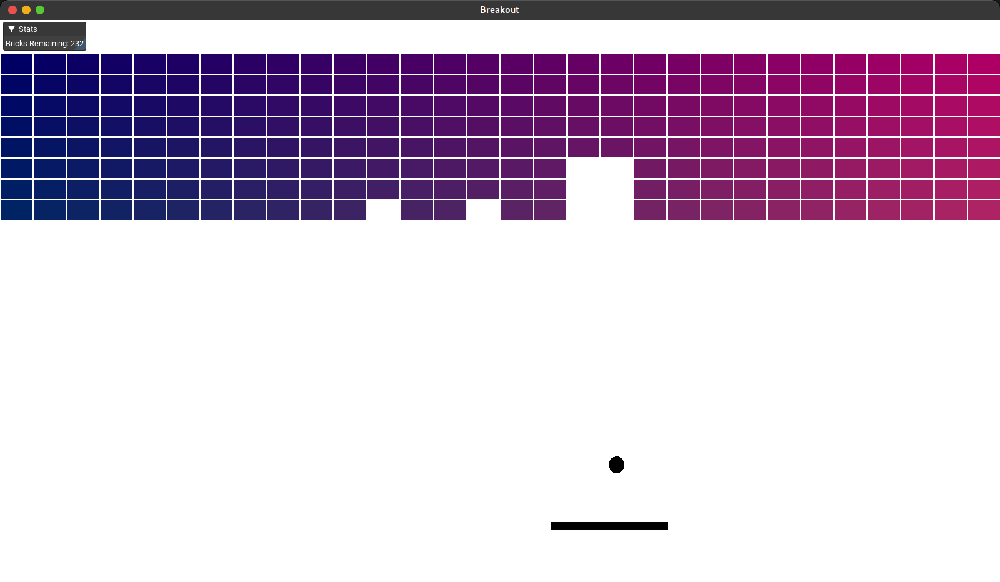

## Gprocessing is a lightweight 2D java game engine
Originally inspired by the Processing 3 graphics library, Gprocessing is easy to use, but also fast.
* Modern OpenGL through the LWJGL 3 library for fast GPU rendering.
* Entity Component System
* Dear ImGui bindings created by [SpaiR/imgui-java](https://github.com/SpaiR/imgui-java)

This project is temporarily on hold during school, because I have alot of it.

## Breakout clone
This is the first game built using Gprocessing, it is a fully functional breakout clone, which I wrote in only three hours.

<br>

## Code Examples
### BoilerPlate Code:
```java
public class Main extends Scene {
	
	public void awake() {		
		camera = new Camera();
	}

	public void update() {
		background(255, 255, 255); // Sets the clear color
	}
}
```

### Simple example with sprites
```java
public class Main extends Scene {
	
	GameObject greenRectangle = new GameObject(new Transform(600, 230, 50, 50), 1);
	GameObject mario = new GameObject(new Transform(600, 200, 50, 50), 2);
	
	public void awake() {		
		camera = new Camera();
		
		greenRectangle.addComponent(new SpriteRenderer(new Color(0, 255, 0, 255))); // Creates a new green sprite component
		mario.addComponent(new SpriteRenderer(new Sprite(Assets.getTexture("src/assets/images/marioSprite.png"))));	// Loads the image from the filesystem into a sprite component
	}

	public void update() {
		background(50, 50, 50); // Sets the clear color
	}
}
```
### Simple example with Dear ImGui
```java
public class Main extends Scene {
	public void awake() {		
		camera = new Camera();
	}

	public void update() {
		background(50, 50, 50);
	}

	public void imgui () {
		ImGui.begin("Demo Window");
		ImGui.text("Hello World");
		ImGui.end();
	}
}
```
  
## Installation
Clone:
`git clone https://github.com/athaun/Gprocessing.git`
open Eclipse, and select import project.
* Eclipse:
  Select the run icon > Run As > 1 java application
  
* Intellj:
  you will have to provide a VM option in the build configuration
  `-Dimgui.library.path=libary/LibImGuiBinaries`

## Documentation
Not yet created.

## Credits

Massive shoutout to Game With Gabe on Youtube for his [amazing tutorial series](https://www.youtube.com/channel/UCQP4qSCj1eHMHisDDR4iPzw/videos) on building a java game engine! 

## License
Copyright (c) 2020 Asher Haun MIT License
See [LICENSE](https://github.com/athaun/Gprocessing/blob/master/LICENSE.md) for more information.

### Milestones:
```
+ 5.1.2020 Started the project
+ 6.2.2020 begin convert to modern OpenGL
+ 6.23.2020 Entity Component System
+ 8.14.2020 Added ImGui
+ 9.21.2020 Fixed imGui input callbacks
! 9.21.2020 Created First game using the Engine!
```
